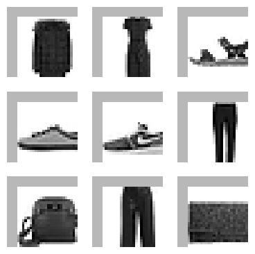
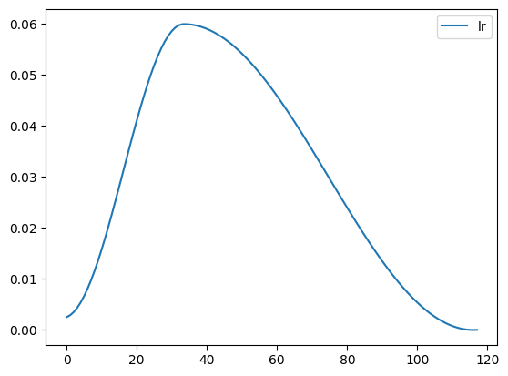
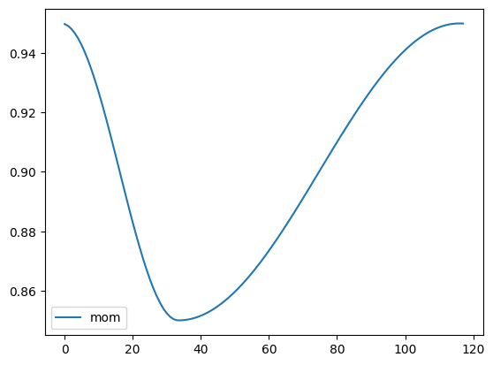
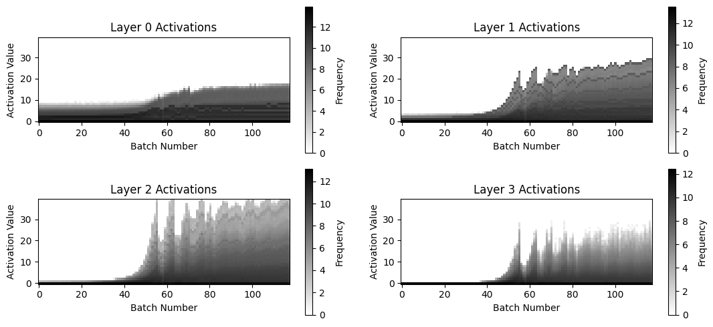
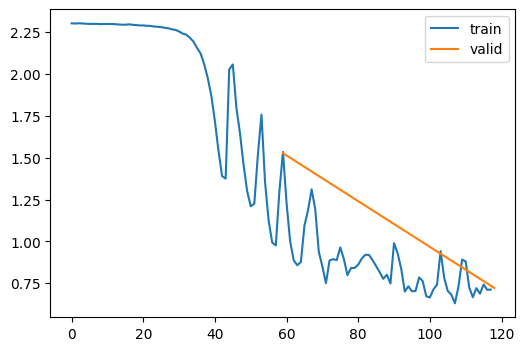
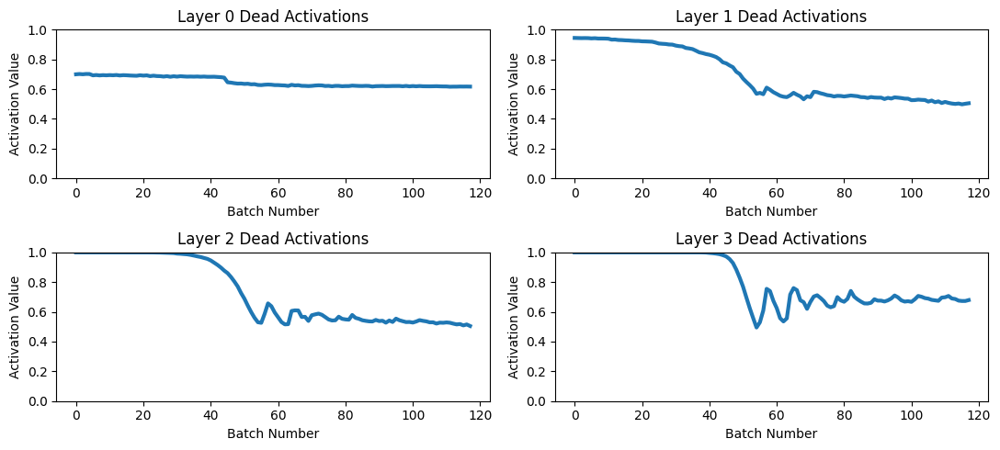

# tinyai

a tiny framework build on top of PyTorch liblary, created during [fast.ai](https://course.fast.ai/) course.

## List of Things in the Framework

### Callbacks

tinyai has many callbacks you can or edit use to customize your training process.

- `DeciceCB` - Callback to set device for model and data.

- `LRFinderCB` - Callback to find the best learning rate.

- `MetricsCB` - Callback to calculate metrics.

- `ProgressCB` - Callback to show progress bar during trainig

- `SingleBatchCB` - Callback to train only one batch.

- `RecorderCB` - Allows to record(save each epoch) stats fore example for lr.\

__And many more__

### Exaple of tinyai use

### Training

``` python
metrics = MetricsCB(accuracy=MulticlassAccuracy())
cbs = [DeviceCB(), metrics]
act_gr = partial(GeneralRelu, leak=0.1, sub=0.4)
iw = partial(init_weights, leaky=0.1)

sched = partial(lr_scheduler.OneCycleLR, max_lr=lr, total_steps=epochs * len(dls.train))
xtra = [BatchSchedCB(sched)]
model = get_model(act_gr, norm=nn.BatchNorm2d).apply(iw)
learn = TrainLearner(model, dls, F.cross_entropy, lr=lr, cbs=cbs+xtra, opt_func=optim.AdamW)


learn.fit(epochs)
```

    {'accuracy': '0.690', 'loss': '0.886', 'epoch': 0, 'train': 'train'}
    {'accuracy': '0.838', 'loss': '0.444', 'epoch': 0, 'train': 'eval'}
    {'accuracy': '0.863', 'loss': '0.381', 'epoch': 1, 'train': 'train'}
    {'accuracy': '0.853', 'loss': '0.396', 'epoch': 1, 'train': 'eval'}

### Data Augmentation

``` python
def tfm_batch(b, tfm_x=fc.noop, tfm_y = fc.noop): return tfm_x(b[0]),tfm_y(b[1])

tfms = nn.Sequential(transforms.RandomCrop(28, padding=4),
                     transforms.RandomHorizontalFlip())

augcb = BatchTransformCB(partial(tfm_batch, tfm_x=tfms), on_val=False)
learn = TrainLearner(model, dls, F.cross_entropy, lr=lr, cbs=[SingleBatchCB(), augcb])
learn.show_image_batch(max_n = 9, imsize=(1.5))
```



### Recorder

``` python
def _lr(cb): return cb.pg['lr']
def _beta1(cb): return cb.pg['betas'][0]

record = RecorderCB(lr=_lr, mom=_beta1)

xtra = [BatchSchedCB(sched), record]
model = get_model(act_gr, norm=nn.BatchNorm2d).apply(iw)
learn = TrainLearner(model, dls, F.cross_entropy, lr=lr, cbs=cbs+xtra, opt_func=optim.AdamW)

learn.fit(epochs)

record.plot()
```





### Hooks

tinyai has a simple hook system that allows you to easily add hooks to
your model, for example we can add a hook to record the mean and std of
the activations of each layer.

#### Activation Stats Hook.

``` python
metrics = MetricsCB(accuracy=MulticlassAccuracy())
astats = ActivationStats(fc.risinstance(nn.ReLU))
cbs = [DeviceCB(), metrics, astats]
learn = TrainLearner(get_model(), dls, F.cross_entropy, lr=0.2, cbs=cbs)
learn.fit(2)

astats.color_dim()

astats.plot_stats()

astats.dead_chart()
```

    {'accuracy': '0.264', 'loss': '2.202', 'epoch': 0, 'train': 'train'}
    {'accuracy': '0.527', 'loss': '1.393', 'epoch': 0, 'train': 'eval'}
    {'accuracy': '0.651', 'loss': '0.951', 'epoch': 1, 'train': 'train'}
    {'accuracy': '0.683', 'loss': '0.821', 'epoch': 1, 'train': 'eval'}







#### Future

This version of the framework propalby won't get updated.

I plan to move this framework to tinygrad to remove dependecies and for fun.
Also maybe to mojo when comes out.
