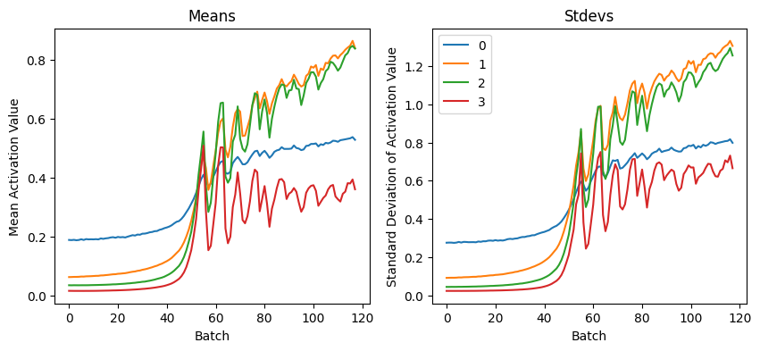

# tinyai

<details>
<summary>Importing utilities (click to show/hide)</summary>

``` python
import torch
import fastcore.all as fc

from torch import nn
from torch.nn import init

from tinyai.datasets import *
from tinyai.conv import *
from tinyai.learner import *
from tinyai.activations import *
from tinyai.init import *
from tinyai.sgd import *
from tinyai.resnet import *
from tinyai.augment import *

from torcheval.metrics import MulticlassAccuracy
from datasets import load_dataset


import torchvision.transforms.functional as TF,torch.nn.functional as F
from torchvision import transforms

from operator import attrgetter,itemgetter
from functools import partial
import matplotlib as mpl,numpy as np,matplotlib.pyplot as plt

from torch import tensor,optim
from torch.optim import lr_scheduler

torch.set_printoptions(precision=2, linewidth=140, sci_mode=False)
import logging
logging.disable(logging.WARNING)
mpl.rcParams['image.cmap'] = 'gray_r'

set_seed(42)
```

</details>

## How to use

### Callbacks

tinyai has many callbacks you can or edit use to customize your training
process.

- `DeciceCB` - Callback to set device for model and data.

- `BatchTransformCB` - Callback to apply a transform to a batch of data.

- `LRFinderCB` - Callback to find the best learning rate.

- `MetricsCB` - Callback to calculate metrics.

- `ProgressCB` - Callback to show progress bar during trainig

- `SingleBatchCB` - Callback to train only one batch.

- `TrainCB` - Callback with base methods(predict,backward,step) to train
  model. It’s intagrated in TrainLearner.

- `RecorderCB` - Allows to record(save each epoch) stats fore example
  for lr.

- `BaseSchedCB` - Callback that allows to intagrate schedulers.

- `EpochSchedCB` - Same as BaseSchedCb, but updates after Epoch.

### Exaple of tinyai use

#### Loading in the data

``` python

dsd = load_dataset("fashion_mnist")

# We can easily transform the data.
xmean,xstd = 0.28, 0.35
@inplace
def transformi(b): b['image'] = [(TF.to_tensor(o)-xmean)/xstd for o in b['image']]

tds = dsd.with_transform(transformi)

# Than load our data into DataLoaders
dls = DataLoaders.from_dd(tds, batch_size=1024, num_workers=4)
```

### Training

``` python
lr, epochs = 1e-2, 2

metrics = MetricsCB(accuracy=MulticlassAccuracy())
cbs = [DeviceCB(), metrics]
act_gr = partial(GeneralRelu, leak=0.1, sub=0.4)
iw = partial(init_weights, leaky=0.1)

tmax = epochs * len(dls.train)
sched = partial(lr_scheduler.OneCycleLR, max_lr=lr, total_steps=tmax)
xtra = [BatchSchedCB(sched)]
model = get_model(act_gr, norm=nn.BatchNorm2d).apply(iw)
learn = TrainLearner(model, dls, F.cross_entropy, lr=lr, cbs=cbs+xtra, opt_func=optim.AdamW)


learn.fit(epochs)
```

    {'accuracy': '0.690', 'loss': '0.886', 'epoch': 0, 'train': 'train'}
    {'accuracy': '0.838', 'loss': '0.444', 'epoch': 0, 'train': 'eval'}
    {'accuracy': '0.863', 'loss': '0.381', 'epoch': 1, 'train': 'train'}
    {'accuracy': '0.853', 'loss': '0.396', 'epoch': 1, 'train': 'eval'}

### Data Augmentation

``` python
def tfm_batch(b, tfm_x=fc.noop, tfm_y = fc.noop): return tfm_x(b[0]),tfm_y(b[1])

tfms = nn.Sequential(transforms.RandomCrop(28, padding=4),
                     transforms.RandomHorizontalFlip())

augcb = BatchTransformCB(partial(tfm_batch, tfm_x=tfms), on_val=False)
model = get_model()
learn = TrainLearner(model, dls, F.cross_entropy, lr=lr, cbs=[SingleBatchCB(), augcb])
learn.show_image_batch(max_n = 9, imsize=(1.5))
```


### Recorder

``` python
def _lr(cb): return cb.pg['lr']
def _beta1(cb): return cb.pg['betas'][0]

record = RecorderCB(lr=_lr, mom=_beta1)

lr, epochs = 6e-2, 2
tmax = epochs * len(dls.train)
sched = partial(lr_scheduler.OneCycleLR, max_lr=lr, total_steps=tmax)
xtra = [BatchSchedCB(sched), record]
model = get_model(act_gr, norm=nn.BatchNorm2d).apply(iw)
learn = TrainLearner(model, dls, F.cross_entropy, lr=lr, cbs=cbs+xtra, opt_func=optim.AdamW)

learn.fit(epochs)
```

    {'accuracy': '0.769', 'loss': '0.653', 'epoch': 0, 'train': 'train'}
    {'accuracy': '0.856', 'loss': '0.410', 'epoch': 0, 'train': 'eval'}
    {'accuracy': '0.883', 'loss': '0.322', 'epoch': 1, 'train': 'train'}
    {'accuracy': '0.878', 'loss': '0.330', 'epoch': 1, 'train': 'eval'}

``` python

record.plot()
```


### Hooks

tinyai has a simple hook system that allows you to easily add hooks to
your model, for example we can add a hook to record the mean and std of
the activations of each layer.

<details>
<summary>Activation Stats Class (click to show/hide)</summary>

``` python
class ActivationStats(HooksCallback):
    def __init__(self, mod_filter=fc.noop):
        super().__init__(append_stats, mod_filter)

    def color_dim(self, figsize=(11,5)):
        fig, axes = get_grid(len(self), figsize=figsize)
        for layer, h in enumerate(self):
            ax = axes.flat[layer]
            im = ax.imshow(get_hist(h), origin='lower')  # Using imshow directly

            # Add labels, title, and colorbar for clarity
            ax.set_xlabel("Batch Number")
            ax.set_ylabel("Activation Value")
            ax.set_title(f"Layer {layer} Activations")
            cbar = plt.colorbar(im, ax=ax)
            cbar.set_label("Frequency")
        plt.tight_layout()  # Prevent overlap

    def dead_chart(self, figsize=(11,5)):
        fig, axes = get_grid(len(self), figsize=figsize)
        for layer, h in enumerate(self):
            ax = axes.flatten()[layer]
            ax.plot(get_min(h), linewidth=3)
            ax.set_ylim(0,1)
            ax.set_xlabel("Batch Number")
            ax.set_ylabel("Activation Value")
            ax.set_title(f"Layer {layer} Dead Activations")
        plt.tight_layout()  # Prevent overlap

    def plot_stats(self, figsize=(10,4)):
        fig, axs = plt.subplots(1,2, figsize=figsize)
        for h in self:
            for i in (0, 1):
                axs[i].plot(h.stats[i])
        axs[0].set_title('Means')
        axs[1].set_title('Stdevs')
        axs[0].set_xlabel("Batch")
        axs[1].set_xlabel("Batch")
        axs[0].set_ylabel("Mean Activation Value")
        axs[1].set_ylabel("Standard Deviation of Activation Value")
        plt.legend(fc.L.range(len(self)))
```

</details>

``` python
metrics = MetricsCB(accuracy=MulticlassAccuracy())
astats = ActivationStats(fc.risinstance(nn.ReLU))
cbs = [DeviceCB(), metrics, astats]
learn = TrainLearner(get_model(), dls, F.cross_entropy, lr=0.2, cbs=cbs)
learn.fit(2)

astats.color_dim()

astats.plot_stats()

astats.dead_chart()
```

    {'accuracy': '0.264', 'loss': '2.202', 'epoch': 0, 'train': 'train'}
    {'accuracy': '0.527', 'loss': '1.393', 'epoch': 0, 'train': 'eval'}
    {'accuracy': '0.651', 'loss': '0.951', 'epoch': 1, 'train': 'train'}
    {'accuracy': '0.683', 'loss': '0.821', 'epoch': 1, 'train': 'eval'}





#### Future

Future of this project:

- Things from the course
- Add poetry for package management
- Add tests
- Maybe move this package to tinygrad or mojo.
- Think about reducing the number of dependencies.
